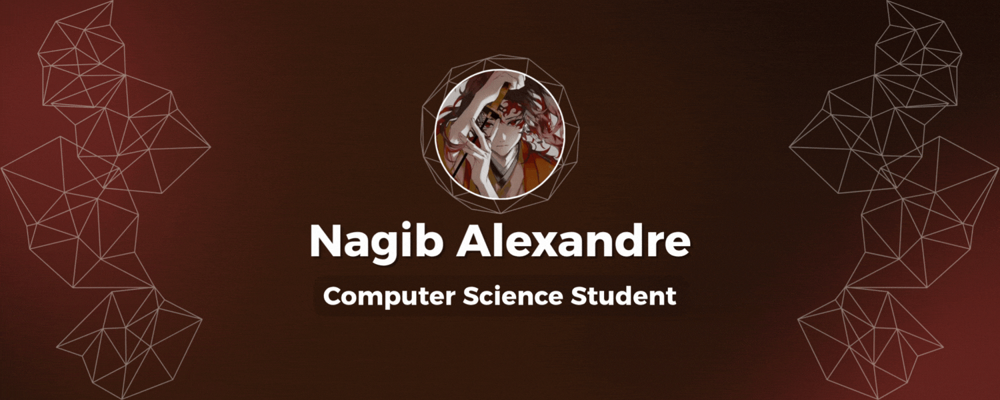

  

# Welcome to my profile 😎🌹

## My name is Nagib Alexandre (ING)
I started in the world of computing at the age of 12 through programming schools aimed at young learners, and later completed a technical high school program in Information Technology at the Federal Institute of Minas Gerais.
I am currently studying Computer Science at the Pontifical Catholic University of Minas Gerais.

Since then, I’ve been continuously striving to deepen my knowledge as much as possible, both in practical and theoretical aspects.

## Meu nome é Nagib Alexandre (PT-BR)
Começei no mundo da computação com 12 anos com escolas de programação para menores, e posteriormente com um curso de ensino médio técnico em informática pelo Instituto Federal de Minas Gerais.
Atualmente curso Ciências da Computação pela Pontifícia Católica de Minas Gerais.

Estou desde então, sempre tentando aprofundar os meus conhecimentos o máximo possível tanto no âmbito prático quanto teórico.

## Languages and Technologies I’ve Used  || Linguagens e Tecnologias que já utilizei 

### Tools | Ferramentas

### Back-end

### Front-end

### Database | Banco de Dados

